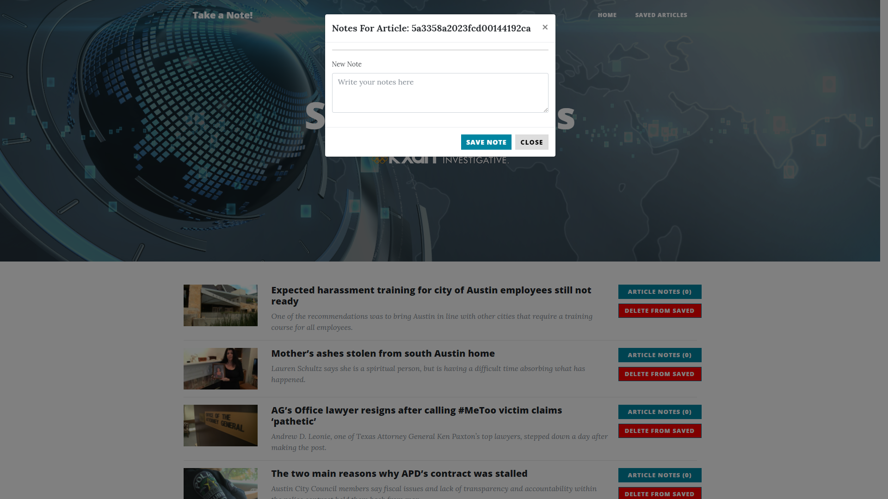

# AustinNewsScraper

### Overview

This app is a web app that lets users view and leave comments on the latest news. It doesn't actually write any articles; instead, it uses Mongoose and Cheerio muscles to scrape news from another site.

* Created an app that accomplishes the following:

  1. Whenever a user visits the site, the app should scrape stories from a news outlet of `http://kxan.com/category/news/local/austin/` and display them for the user. Each scraped article should be saved to the application database. At a minimum, the app should scrape and display the following information for each article:

     * Headline - the title of the article

     * Summary - a short summary of the article

     * URL - the url to the original article

     * Photo - a thumbnail of the article

  2. Users should also be able to leave comments on the articles displayed and revisit them later. The comments should be saved to the database as well and associated with their articles. Users should also be able to delete comments left on articles. All stored comments should be visible to every user.

